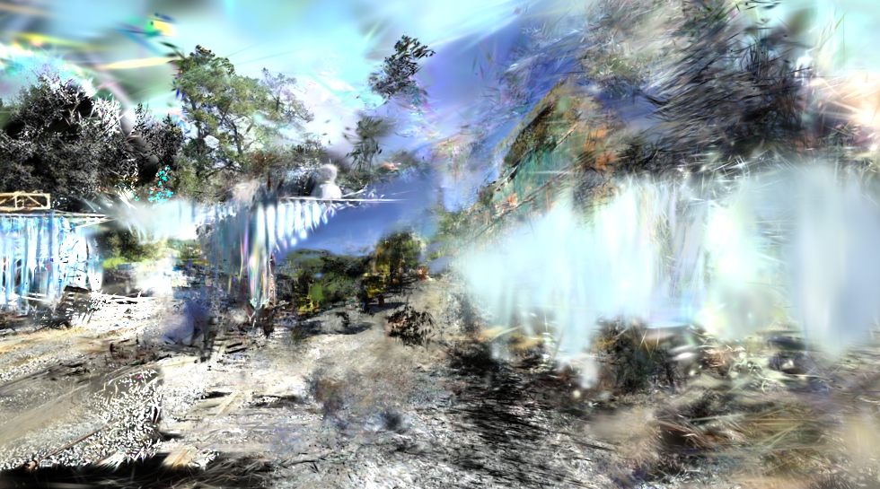
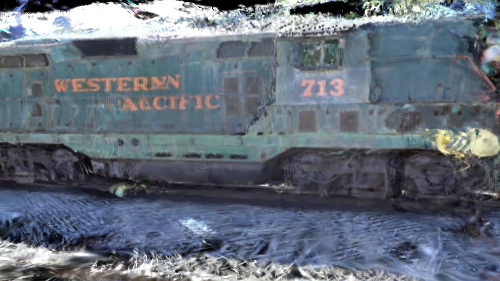
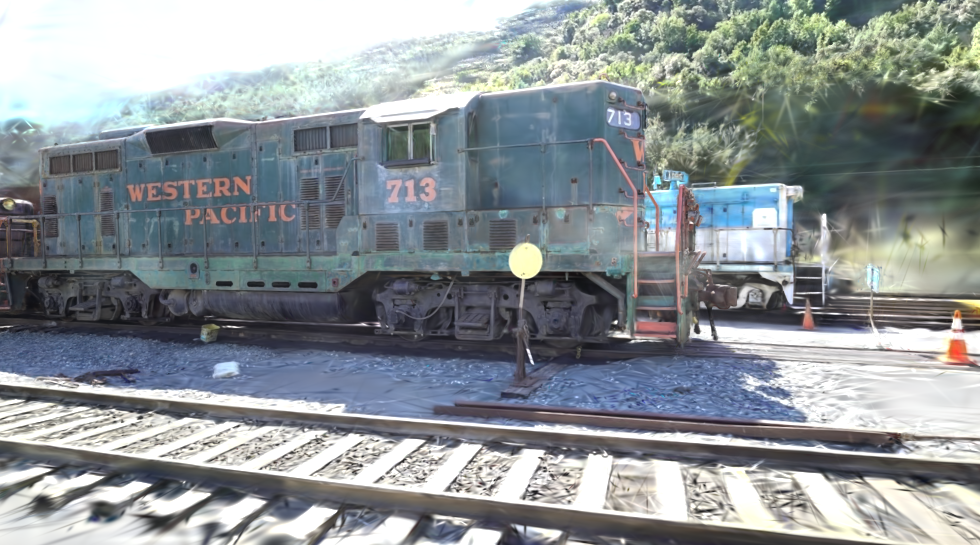

# Multi-view Generative Augmented 3D Reconstruction Pipeline
**B.Eng Final Year Project — David Ogunmola (kdavid001)**

---

## About This Research

This project investigates the reconstruction of photorealistic 3D scenes from sparse, degraded image inputs using **3D Gaussian Splatting (3DGS)** as the core rendering framework. The central problem addressed is that real-world 3D capture is rarely ideal, photographers cannot always provide the dense, uniformly distributed, high-quality imagery that classical Structure-from-Motion (SfM) and neural rendering pipelines assume. This work proposes and evaluates an augmentation pipeline that recovers reconstruction quality from as few as 12 input images, including images affected by blur, poor exposure, colour cast, and missing viewpoints.

The pipeline operates in three stages:
1. **Quality Screening** — A five-pillar radiometric screener (MUSIQ + saturation, exposure, contrast, colour cast) evaluates each input image and routes it to the appropriate augmentation path across three scene-adaptive modes (natural, indoor, synthetic).
2. **Generative Augmentation** — Three diffusion-based modes handle different scene types: **Zero123++** (Mode A) synthesises geometrically consistent novel views for object-centric scenes; **ControlNet Tile** (Mode B) restores degraded images; **ViewCrafter** (Mode C) interpolates between sparse viewpoints for real-world scenes using DUSt3R point cloud conditioning.
3. **AI-Driven Pose Estimation** — **SuperPoint + LightGlue** exhaustive feature matching replaces classical SIFT for COLMAP-based camera pose estimation, enabling registration in cases where SIFT fails entirely.

### Key Result
The proposed pipeline recovers **51.3% of the quality gap** between a sparse no-augmentation baseline (PSNR 9.60 dB) and the full 301-image upper bound (PSNR 21.99 dB), using only **12 sparse input images** — a **96% reduction** in acquisition effort.

| Condition | Images | PSNR ↑ | SSIM ↑ | LPIPS ↓ |
|---|---|---|---|---|
| Baseline B — Sparse + SIFT | 12 (FAILED) | N/A | N/A | N/A |
| Ablation — Sparse + AI matching | 12 | 9.60 dB | 0.2674 | 0.5628 |
| **Proposed — ViewCrafter + AI matching** | **12** | **15.96 dB** | **0.5456** | **0.3809** |
| Baseline A — Full dataset + SIFT | 301 | 21.99 dB | 0.8069 | 0.2084 |

---

## Repository Structure

```
3D_project/
├── process_file.py              # Five-pillar quality screener (MUSIQ-based, 3 modes)
├── convert_ai.py                # SuperPoint + LightGlue → COLMAP pose estimation
│                                #   (replaces convert.py from gaussian-splatting)
├── diffusion_script_v0.py       # Generative augmentation engine (Modes A / B)
├── corrupt_data.py              # Dataset corruption simulator (blur, exposure, noise)
├── requirements.txt             # Python dependencies
├── user_guide.md                # Full setup and usage instructions
├── Pipeline_files/
│   └── unified_pipeline.ipynb  # Main Colab notebook — all three pipeline modes
├── algorithm_for_codes/         # Detailed pseudocode for all 6 algorithms
├── Code_Reports/
│   ├── experimental_results.md  # Full experimental log and results table
│   └── flowdiagram/             # Mermaid flowcharts for all pipeline stages
└── algorithm_summaries/         # Condensed algorithm summaries
```

---

## Visual Results — Train Scene

Rendered novel views comparing reconstruction quality across conditions (same scene, held-out test viewpoints):

| Ablation — 12 images, AI matching, no augmentation | Proposed — 12 images + ViewCrafter | Baseline A — 301 images (upper bound) |
|:---:|:---:|:---:|
|  |  |  |
| PSNR 9.60 dB · SSIM 0.267 · LPIPS 0.563 | **PSNR 15.96 dB · SSIM 0.546 · LPIPS 0.381** | PSNR 21.99 dB · SSIM 0.807 · LPIPS 0.208 |

The proposed pipeline recovers visible scene geometry and texture with only 12 input images. The ablation (same 12 images, no ViewCrafter augmentation) produces a heavily artefacted reconstruction due to insufficient camera coverage for 3DGS densification.

---

## Dependencies

### 1. Clone this repository
```bash
git clone https://github.com/kdavid001/3D_project.git
cd 3D_project
```

### 2. Clone gaussian-splatting (required for training)
This project builds on the official 3D Gaussian Splatting implementation. Clone it separately:
```bash
git clone https://github.com/graphdeco-inria/gaussian-splatting --recursive
```
Use `convert_ai.py` from this repo **instead of** `convert.py` from gaussian-splatting for AI-based pose estimation. All other training scripts (`train.py`, `render.py`, `metrics.py`) come from gaussian-splatting.

### 3. Install dependencies
```bash
pip install -r requirements.txt
```

### 4. ViewCrafter (Mode C — real-world scenes)
ViewCrafter requires a separate Conda environment. See [user_guide.md](user_guide.md) for full setup instructions including DUSt3R and model checkpoint downloads.

---

## Quickstart

See [user_guide.md](user_guide.md) for full setup and usage instructions, including:
- Running the quality screener (`process_file.py`)
- Running generative augmentation (Modes A / B / C)
- Running AI-based pose estimation (`convert_ai.py`)
- Training and evaluating the 3DGS scene

---

## Research Directions

Several components of this pipeline have potential as standalone research contributions and are being explored for future publication:

- **Domain-Adaptive Radiometric Quality Screening for 3D Reconstruction** — The five-pillar MUSIQ-based screener (`process_file.py`) with scene-adaptive thresholding (natural / indoor / synthetic modes) addresses a gap in existing pipelines, which either skip input quality assessment entirely or rely on a single metric. A focused study on its false-positive/false-negative rate across diverse scene types could form a standalone contribution.

- **Learned Feature Matching as a SIFT Replacement for Sparse-Input 3DGS** — `convert_ai.py` demonstrates that SuperPoint + LightGlue exhaustive matching enables camera registration from as few as 12 wide-baseline images where classical SIFT fails completely. A systematic benchmarking study across scene types and sparsity levels would establish this as a replicable finding.

- **Generative Augmentation Routing for 3DGS Reconstruction** — The adaptive routing framework (quality tag + scene type → diffusion model selection) is the primary contribution of this work. Extending the evaluation to more scenes, augmentation models, and sparsity levels is the natural next step toward a full research paper.

---

## Citation

If you use this work, please also cite the following:

- Kerbl et al. (2023) — [3D Gaussian Splatting](https://repo-sam.inria.fr/fungraph/3d-gaussian-splatting/)
- Shi et al. (2023) — [Zero123++](https://github.com/sudo-ai-3d/zero123plus)
- Yu et al. (2024) — [ViewCrafter](https://github.com/Drexubery/ViewCrafter)
- Zhang et al. (2023) — [LightGlue](https://github.com/cvg/LightGlue)
- Wang et al. (2023) — [DUSt3R](https://github.com/naver/dust3r)
